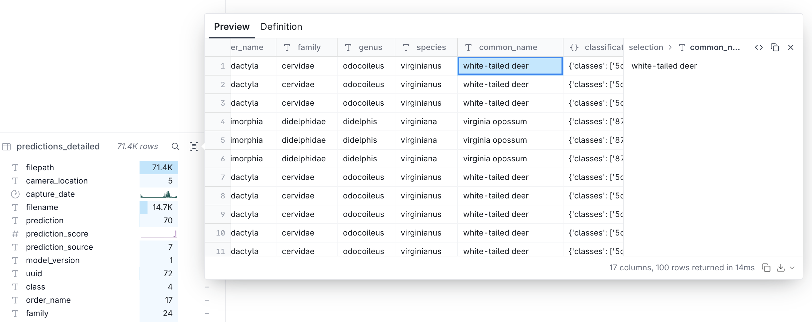

# SpeciesNet

This folder contains experiment results of applying [SpeciesNet](https://github.com/google/cameratrapai) to our Stone Mountain dataset.

## Methods

[SpeciesNet](https://github.com/google/cameratrapai) is an animal classification model developed by Google for camera trap images. It is designed to accurately identify wildlife species from images captured by motion-activated cameras in natural habitats. We ran the SpeciesNet animal classification model on our Stone Mountain dataset using the following methods:

1. Download the pre-trained SpeciesNet model weights from the official repository:

```sh
$ pip install speciesnet
```

2. Prepare our Stone Mountain camera trap images using [organizeImagesByCaptureDate.py](../../scripts/organizeImagesByCaptureDate.py)

3. Run the SpeciesNet inference script on our dataset. We used the ICE cluster (NVIDIA V100 16GB) for this step, and the inference took approximately 4 hours for the full dataset of ≈70k images.

```sh
$ python -m speciesnet.inference \
    --folders ./ \
    --predictions_json predictions-full-dataset.json \
```

4. Convert the result json into `duckdb` format for easier analysis. `.duckdb` file is included in this repository: [speciesnet_result.duckdb](./speciesnet_result.duckdb)

5. Launch a `duckdb` web UI to explore the results. On macOS, you can install `duckdb` via Homebrew: `$ brew install duckdb`.

```sh
$ duckdb speciesnet_result.duckdb -ui
```

We can use the UI in the browser to run SQL queries on the inference results.



## Results

### Key Statistics

- Total images: 71,430 across 5 camera locations (`SM_1` through `SM_5`)
- Time span: January 2017 to April 2025 (8+ years, 969 unique capture days)
- Species detected: 60 unique species
- Images with animals: 27,066 (37.9%)
- Blank images: 44,364 (62.1%)
- Average confidence: 92.85% for animal detections

### Top 10 Species Detected

| Rank | Species               | Detections | Avg Confidence | Confidence Range | Camera Locations | Top Location |
| ---- | --------------------- | ---------- | -------------- | ---------------- | ---------------- | ------------ |
| 1    | White-tailed deer     | 12,806     | 97.6%          | 65.0% - 100.0%   | 5/5              | SM_1 (8,302) |
| 2    | Eastern gray squirrel | 5,975      | 97.3%          | 65.6% - 99.9%    | 5/5              | SM_1 (5,644) |
| 3    | Human (\*)            | 2,249      | 85.0%          | 50.1% - 100.0%   | 5/5              | SM_2 (1,144) |
| 4    | Bird (unspecified)    | 771        | 86.6%          | 65.0% - 99.5%    | 5/5              | SM_4 (477)   |
| 5    | Northern raccoon      | 725        | 97.5%          | 65.9% - 99.9%    | 5/5              | SM_1 (638)   |
| 6    | Coyote                | 178        | 92.7%          | 66.0% - 99.8%    | 5/5              | SM_1 (95)    |
| 7    | Virginia opossum      | 125        | 96.5%          | 65.9% - 100.0%   | 2/5              | SM_1 (115)   |
| 8    | Odocoileus species    | 122        | 76.3%          | 65.0% - 99.7%    | 4/5              | SM_1 (66)    |
| 9    | Sciurus species       | 110        | 76.2%          | 65.0% - 98.0%    | 3/5              | SM_1 (96)    |
| 10   | Eastern chipmunk      | 101        | 90.9%          | 65.2% - 99.1%    | 3/5              | SM_3 (73)    |

- (\*) Human activity concentrated at `SM_2` (1,144 detections) and `SM_5` (698 detections).

### Temporal Patterns

**Seasonal Activity:**

- Most active year: 2023 with 42,530 images
- Peak months for wildlife: November (62.5% animal presence) and August (58.9%)
- Lowest activity: March (21.0% animal presence)
- Species diversity peaked in 2023 with 48 unique species detected

### Taxonomic Distribution

- Mammals: 85.6% of animal detections
- Birds: 3.3%
- Others/Unknown: 11.1%

### Database Structure

I created two tables:

- `predictions` - Raw flattened data from JSON
- `predictions_detailed` - Enhanced with parsed taxonomy (class, order, family, genus, species, common_name) and temporal fields

## TODO

- Compare the results with human-labeled data for accuracy assessment
- Compare the results against different models including VLMs (Vision Language Models)
- Visualize trends and species distribution
